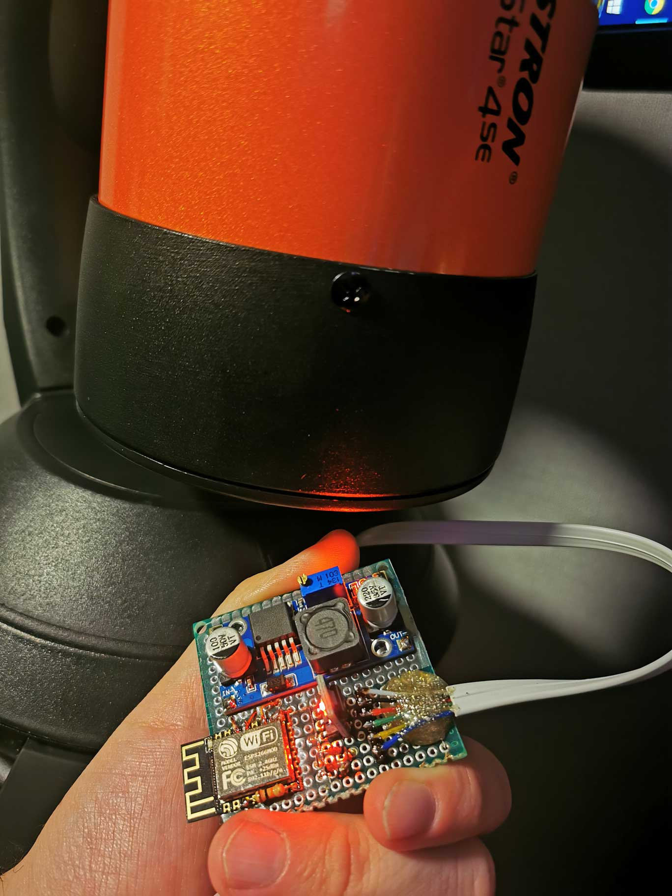
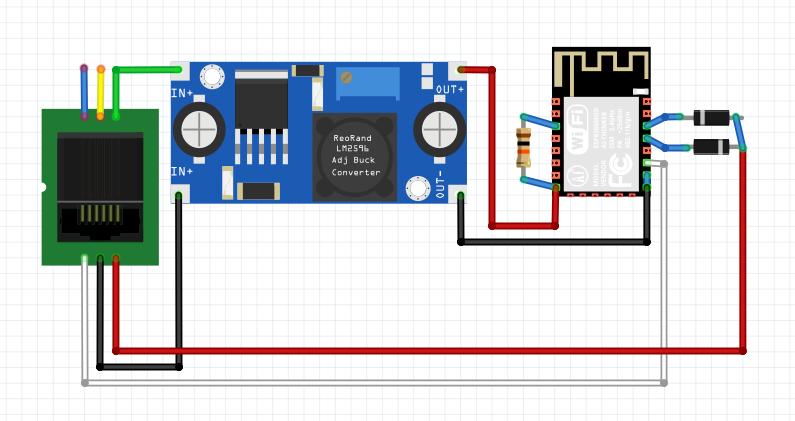
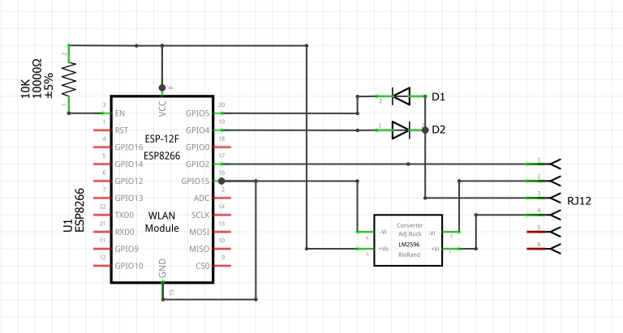

# CelestronESPWifi
ESP8266 based wifi adapter for Celestron telescopes

The official Celestron Skyportal WiFi module is €190~. (aka SkyQ Link, aka Skylink)

CelestronESPWifi parts list:
  * ESP8266 Module: €1.25c
  * Buck Converter: €0.75c
  * Cable: €3.00
  * Jellybeans: €2.00

Total = less than €10 anyway.

## Notes and Features ##

1. Works with SkyPortal App seemingly perfectly.
2. Does not like other peripherals yet (keypad must be unplugged)
3. ESP firmware can be updated remotely

## Example Build ##

## Minimum Parts List ##

* ESP8266 Module (Example 12F)*
* ESP8266 Programmer*
* 2 Diodes
* 1 10K Resistor*
* Buck Converter (Example: LM2596)
* RJ12 Cable

*Alternatively you can use something like a NodeMCU and set the buck converter to 5v instead of 3.3v needed for a bare ESP.

## Firmware Notes ##

ESP firmware will host a wifi access point, default named Celestron. The ESPs IP is 1.2.3.4 and opens a tcp listen port on port 2000. Don't change these as it's a requirement for the SkyPortal app to work. Port 80 can be accessed to update firmware over HTTP if required - please make sure to flash it before you embed it in a project :)

Because [SoftwareSerial](https://www.arduino.cc/en/Reference/softwareSerial) is used - we can choose what pins to TX and RX on, so if it needs changing afterwards this can be updated in the sketch and uploaded over HTTP. Just make sure the diodes are in the correct direction for the TX and RX data flow. Similarly the RST pin can be changed. If you plan to use a bare ESP, I recommend not to use GPIO15 as it will be shorted to ground.

## Hardware Notes ##

If you use a bare ESP; set the buck converter voltage to 3.3v, any other module such as a NodeMCU will take 5v.
The scope uses a UART system over one wire. Multiple devices can communicate on this same bus by pulling RST low, then sending data. Source and Destination IDs are sent in the packets so devices know what data is for them.
There have been varying reports from other smarter people on pull up/down resistor anomalies so if you deviate from this design you may come into those issues, see reading material below. 

## Similar projects ##

This project would be much more difficult without the help of these posts:

https://sebastianfoerster86.wordpress.com/2020/08/10/celestron-teleskop-skyq-link-wi-fi-hack/

https://sites.google.com/site/wayneholder/nexstar-direct-telescope-mount-control

https://www.cloudynights.com/topic/652569-nexremote-cable-with-usb-ttl-serial-uart-converter-cable-with-ftdi-chip/page-2

Simply having this info meant that I could confirm my setup worked and my logic analyser was reading expected data.

## Additional Notes ##

On AA battery power, when the batteries are low at some point the motors will stop working. In this situation the ESP will probably still have power and the ability to communicate and link to the Skyportal app successfully. Input commands to the motor will not work, there is no indication of low power. It seems this behaviour is normal and even the official keypad gives you no low-power warning. Don't panic, simply get new batteries.

CelestronESPWifi was developed and confirmed working on a Celestron Nexstar 4SE.
